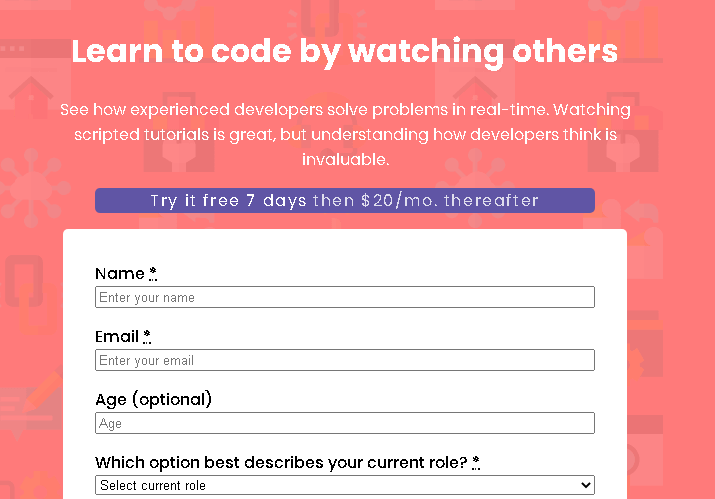

# Freecodecamp - Survey Form

This is a solution to the [Build a survey form, proyect 2 for responsive web design certificate](https://www.freecodecamp.org/learn/responsive-web-design/responsive-web-design-projects/build-a-tribute-page). 

## Table of contents

- [Overview](#overview)
  - [The challenge](#the-challenge)
  - [Screenshot](#screenshot)
  - [Links](#links)
- [My process](#my-process)
  - [Built with](#built-with)
  - [What I learned](#what-i-learned)
  - [Continued development](#continued-development)
  - [Useful resources](#useful-resources)
- [Author](#author)
- [Acknowledgments](#acknowledgments)

## Overview

### The challenge

Users should be able to:

- View the optimal layout for the component depending on their device's screen size

### Screenshot

### Links

- Solution URL: [Solucion Page tribute](https://github.com/samuelpklm/freecodecamp-Responsive_Web_Design/tree/main/Proyecto%201%20-%20Build%20a%20Tribute%20Page)
- Live Site URL: [Page tribute](https://glowing-druid-b887c6.netlify.app/)

## My process

### Built with

- Semantic HTML5 markup
- CSS custom properties
- Flexbox
- Mobile-first workflow

### What I learned

I learned to properly structure the forms.

### Useful resources

- [structure forms]https://developer.mozilla.org/es/docs/Learn/Forms/How_to_structure_a_web_form) - It helped me understand how the forms are structured

## Author

- Website - [Samuel Rodriguez](https://github.com/samuelpklm)
- Frontend Mentor - [@samuelpklm](https://www.frontendmentor.io/profile/samuelpklm)
- Email - [@Samuel Rodriguez](samuelr76@gmail.com)

## Acknowledgments
- Grateful to the freecodecamp team for their great studio platform.
- thanks to frontend-mentor for providing all the artistic content.